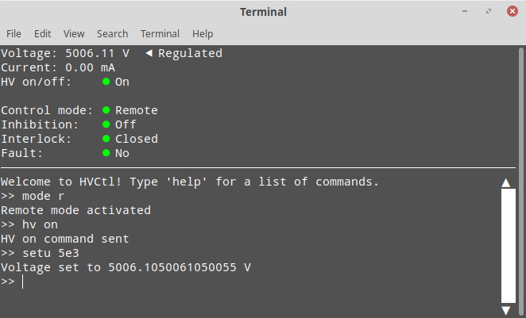

Usage
=====

Interactive mode
----------------

HVCtl may be launched in an interactive mode by running the ``__main__.py`` script inside the ``hvctl`` package.
This is done with the command

::

    $ python path/to/hvctl -args
    
Because this command requires providing the relative or absolute path to the ``hvctl`` package every time it is used, 
HVCtl also provides a shell script which automatically fills in the path before calling the command.
If the ``HVCtl`` directory is added to ``$PATH``, the shell script can be run from any directory with

::

    $ hvctl-run -args 

Both of these commands accept the following command-line arguments:

-h, --help          Show a help message that lists all command-line arguments.

-c, --config path   Define a configuration file. If this argument isn't defined, the default file ``HVCtl/hvctl/default.conf`` is used instead.
                    The default file contains the documentation for all configuration options.

-p, --port port     Define the port (e.g. ``/dev/ttyUSB0``) used for the serial connection.
                    If this argument is defined, it overrides the port defined in the configuration file.

-v, --virtual       Run HVCtl with a virtual HV generator. 
                    If this argument is included, instead of sending messages to a real HV generator, HVCtl creates a simulated, virtual one and sends messages to that.
                    This makes it possible to test HVCtl easily without having to connect to an actual HV generator.     
                    This option is incompatible with ``-p``.

-s, --simple        Run HVCtl with a simple command-line interface that doesn't require :ref:`urwid <dependencies>`.
                    If HVCtl is run without the ``-s`` argument, a more advanced UI will be used (see below for  an example).

-n, --no-poll       Disable automatic polling. If automatic polling is enabled, HVCtl automatically sends messages to the HV generator at regular intervals.
                    Disabling this functionality makes the generator automatically turn the HV off if the user doesn't send it a command for 5 seconds.
                    Additionally, each status variable displayed by the UI will only be updated whenever the generator sends back the value of the variable as a response to a command sent by the user.  

Testing the interlock
.....................

When HVCtl is run with the ``-v`` argument, it communicates with the virtual HV generator only by sending messages through the virtual serial connection.
Because of this, in this mode it is impossible to test actions that require physical access to the HV generator, such as opening the :ref:`interlock <interlock>`.

.. Using :ref:`interlock` would be rendered as 'Bit 3: interlock'.

However, physical access to the generator can be simulated with the ``test-interlock`` script (located in the ``HVCtl`` directory).
Running the script in a terminal creates a virtual HV generator, prints the name of its port, and starts a simple command-line UI.
The virtual HV generator can then be controlled with HVCtl by launching HVCtl in another terminal window with the ``-p`` argument and supplying the port name printed by ``test-interlock``.
The interlock of the virtual HV generator can be opened and closed through the UI of ``test-interlock``, and these actions affect HVCtl session running in the other window.

Importing
---------

HVCtl also includes an importable API for controlling the HV generator programmatically. 
The API is used by creating an instance of the :class:`~hvctl.api.API` class and calling its methods, 
and the :class:`~hvctl.virtualhv.VirtualHV` class allows it to be tested without access to a physical HV generator.
These two classes are members of the ``hvctl`` namespace as well as the namespaces of their own modules, 
so they can be imported with 

>>> from hvctl import API, VirtualHV

as well as

>>> from hvctl.api import API
>>> from hvctl.virtualhv import VirtualHV

All importable modules in the ``hvctl`` package are listed in the :doc:`Modules <modules/index>` page. 

Examples
--------

The following examples demonstrate reading and setting the voltage by using the different interfaces provided by HVCtl.

Interactive mode with ``-s``
............................

HVCtl is run in interactive mode with the ``-s`` argument, resulting in a simple command-line ui.
The UI imports the :mod:`readline` module, which enables command editing and browsing command history with the up and down arrows.

::

    $ hvctl-run -s
    Welcome to HVCtl! Type 'help' for a list of commands.
    >> mode remote
    Remote mode activated
    >> hv on
    HV on command sent
    >> getvoltage
    The voltage is 0.0 V
    >> setvoltage 5000
    Voltage set to 5006.1050061050055 V
    >> getvoltage
    The voltage is 5006.1050061050055 V
    >> exit

Interactive mode without ``-s``
...............................

Here the ``-s`` argument hasn't been given, and HVCtl uses a more advanced UI. 
The bottom of the UI is an interactive command-line interface similar to the one above, but the top part contains a screen showing the current status of the HV generator. 
The command-line interface can be scrolled using the mouse wheel, clicking the scroll bar next to the command-line interface, or clicking the arrow buttons above and below the scroll bar.
This example also demonstrates how the commands can be written more quickly by using aliases.

Using the API
.............

This example demonstrates using HVCtl in an interactive Python interpreter with an :class:`~hvctl.api.API` object. 
The last call to :meth:`~hvctl.api.API.halt()` closes the serial connection and the parallel thread that is used to poll the HV generator to keep it from switching to local mode.

>>> import hvctl
>>> api = hvctl.API()
>>> api.set_mode('remote')
>>> api.set_voltage(-5000)
-5006.1050061050055
>>> api.get_voltage()
-0.0
>>> api.hv_on()
>>> api.get_voltage()
-5006.1050061050055
>>> api.halt()

Using the API with a virtual HV generator
.........................................

This is an example of a Python script that uses a virtual HV generator.
The script uses ``with`` blocks to ensure that both the :class:`~hvctl.api.API` and the :class:`~hvctl.virtualhv.VirtualHV` are closed properly at the end.

::

    from hvctl import API, VirtualHV

    with VirtualHV as vhv:
        with API(port=vhv.connection.port) as api:
            api.set_mode('remote')
            # More code here...
